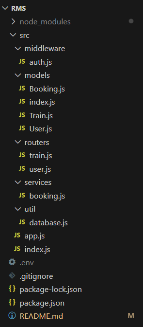

# Railway Management System API

This is a Railway Management System API built using Node.js, Express, Sequelize, and MySQL. It provides functionalities to manage trains, book seats, and manage user roles (admin and user).

## Table of Contents

- [Getting Started](#getting-started)
- [Environment Variables](#environment-variables)
- [Database Setup](#database-setup)
- [Project Structure](#project-structure)
- [API Endpoints](#api-endpoints)
  - [User Routes](#user-routes)
  - [Train Routes](#train-routes)
- [Authorization and Authentication](#authorization-and-authentication)
- [Error Handling](#error-handling)
- [Future Improvements](#future-improvements)

---

## Getting Started

### Prerequisites

- Node.js (>= 16.x)
- [Sequelize (v6)](https://sequelize.org/docs/v6/)
- MySQL

### Installation

1. **Clone the repository**:

   ```bash
   git clone https://github.com/bhavuk2002/rms.git
   cd rms
   ```

2. **Install dependencies**

   ```bash
   npm install
   ```

3. **Setup environment variables** : Create a `.env` file in the root directory and add the required variables (refer to the [Environment Variables](#environment-variables) section).

4. **Run the application** :

   ```bash
   npm start
   ```

---

# Environment Variables

Ensure you have a `.env` file with the following keys:

```
PORT=3000
JWT_TOKEN_SECRET=your-jwt-secret
ADMIN_API_KEY=your-api-key
DATABASE_NAME=your-database-name
DATABASE_USER=your-database-user
DATABASE_PASSWORD=your-database-pass
DATABASE_HOST=your-database-host
```

# Database Setup

1. Create a MySQL database named `rms` or `<any of your choice>`.
2. Configure the database connection in the `util/database.js` file.

# Project Structure



# API Endpoints

## User Routes

### 1. Create a New User

- **URL**: `/createUser`
- **Method**: `POST`
- **Request Body**:
  ```json
  {
    "username": "string",
    "password": "string",
    "role": "string" // Optional: defaults to 'user'
  }
  ```
- **Response**:

  ```json
  {
    "user": {
      "role": "string",
      "id": "integer",
      "username": "string"
    },
    "token": "string"
  }
  ```

- **Description**: Registers a new user and returns the user data along with a JWT token.

### 2. User Login

- **URL**: `/login`
- **Method**: `POST`
- **Request Body**:
  ```json
  {
    "username": "string",
    "password": "string"
  }
  ```
- **Response**:

  ```json
  {
    "user": {
      "id": "integer",
      "username": "string",
      "role": "string"
    },
    "token": "string"
  }
  ```

- **Description**: Authenticates a user and returns the user data along with a JWT token.

## Train Routes

### 3. Add a Train (Admin Only)

- **URL**: `/addTrain`
- **Method**: `POST`
- **Headers**:
  - `Authorization: Bearer <token>`
  - `x-api-key: <ADMIN_API_KEY>`
- **Request Body**:

  ```json
  {
    "name": "string",
    "source": "string",
    "destination": "string",
    "totalSeats": "integer",
    "availableSeats": "integer"
  }
  ```

- **Response**:

  ```json
  {
    "id": "integer",
    "name": "string",
    "source": "string",
    "destination": "string",
    "totalSeats": "integer",
    "availableSeats": "integer",
    "createdAt": "DATETIME",
    "updatedAt": "DATETIME"
  }
  ```

- **Description**: Adds a new train to the system. This endpoint is restricted to admin users.

### 4. Get Seat Availability / Trains Between Stations

- **URL**: `/betweenStations`
- **Method**: `POST`
- **Headers**:
  - `Authorization: Bearer <token>`
- **Query Parameters**:

  - `source=string`
  - `destination=string`

- **Response**:

  ```json
  [
    {
      "id": "integer",
      "name": "string",
      "source": "string",
      "destination": "string",
      "availableSeats": "integer"
    }
  ]
  ```

- **Description**: Retrieves all trains running between the specified source and destination.

### 5. Book a Train Seat

- **URL**: `/bookTrain`
- **Method**: `POST`
- **Headers**:
  - `Authorization: Bearer <token>`
- **Request Body**:

  ```json
  {
    "trainId": "integer"
  }
  ```

- **Response**:

  ```json
  {
    "message": "Seat booked successfully",
    "bookingId": "integer",
    "trainId": "integer",
    "seatNumber": "integer"
  }
  ```

- **Description**: Books a seat on the specified train for the authenticated user.

### 6. Get Booking by ID

- **URL**: `/booking/:bookingId`
- **Method**: `POST`
- **Headers**:

  - `Authorization: Bearer <token>`

- **Response**:

  ```json
  {
    "id": "integer",
    "userId": "integer",
    "trainId": "integer",
    "seatNumber": "integer"
  }
  ```

- **Description**: Retrieves booking details by the booking ID for the authenticated user.

### 7. Get All Bookings for Logged-In User

- **URL**: `/bookings`
- **Method**: `POST`
- **Headers**:

  - `Authorization: Bearer <token>`

- **Response**:

  ```json
  [
    {
      "id": "integer",
      "userId": "integer",
      "trainId": "integer",
      "seatNumber": "integer"
    }
  ]
  ```

- **Description**: Retrieves all bookings for the authenticated user. If no bookings are found, a message will be returned.

# Authorization and Authentication

- **JWT Authentication**: The API uses JWT for user authentication. Users receive a token upon login, which must be sent in the - Authorization header for protected routes.
- **Role-Based Access Control**: Routes are protected based on user roles (admin/user).
- **Admin API Key**: Admin-only routes require an x-api-key header.

# Error Handling

The API returns appropriate HTTP status codes and error messages. Common status codes used:

- `200 OK`: Request successful
- `201 Created`: Resource created successfully
- `400 Bad Request`: Invalid request data
- `401 Unauthorized`: Missing or invalid authentication token
- `403 Forbidden`: Insufficient permissions
- `404 Not Found`: Resource not found
- `500 Internal Server Error`: Server-side error

# Future Improvements

1. **Booking Invalidity After Trip Completion**: Automatically mark tickets as invalid once the trip is completed.

2. **Cancellation and Refund System**: Implement a cancellation policy allowing users to cancel bookings

3. **User Profile Management**: Allow users to update profiles, change passwords, and manage personal information.

4. **Train Schedule Management**: Enable admins to manage and update train schedules and routes.

5. **Advanced Search Filters**: Add advanced search options for users to filter trains by departure time, duration, and price.

6. **Notifications and Alerts**: Create a notification system to inform users about booking statuses, train delays, and cancellations

### Feel free to reach out for any questions or further improvements. Happy coding!
